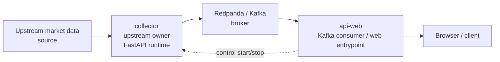
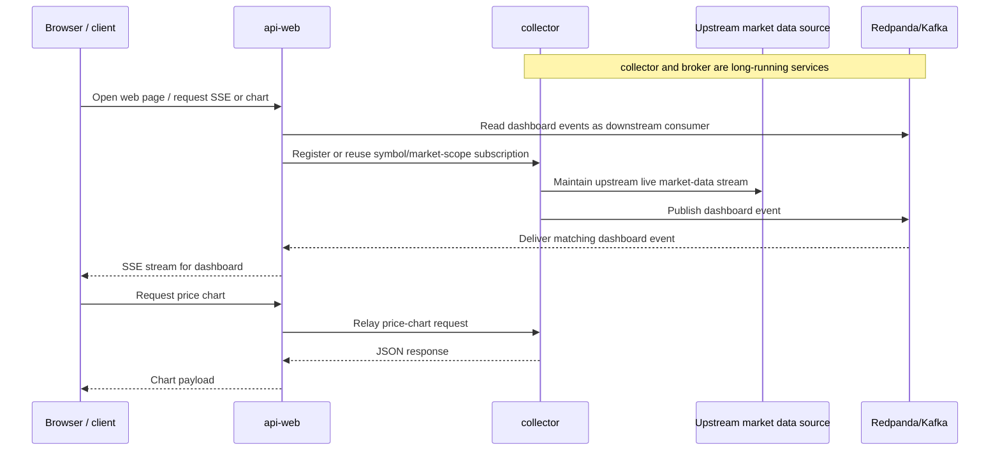

# korea-market-data-hub

`korea-market-data-hub`는 **국내 주식 시장 데이터를 수집하고 스트리밍하는 Python 기반 오픈소스 허브 스택**입니다. 현재 공개 저장소 기준으로는 특정 업스트림 시장 데이터 소스를 연결해 라이브 수집을 검증할 수 있으며, 수집한 이벤트를 Redpanda로 발행하고 HTTP/SSE 및 웹 화면으로 확인할 수 있습니다.

핵심 목적은 완성형 트레이딩 제품을 제공하는 것이 아니라, **국내 시장 데이터 수집·전달·조회 흐름을 로컬에서 재현하고 확장할 수 있는 허브 기반**을 제공하는 것입니다.

## Overview

- **실시간 수집**: 업스트림 시장 데이터 소스를 통한 국내 주식 시세 수집
- **이벤트 스트리밍**: Redpanda(Kafka API)로 대시보드 이벤트 전달
- **조회 인터페이스**: HTTP API와 브라우저 SSE 지원
- **웹 확인 화면**: 기본 실시간 대시보드 제공
- **실행 방식**: Python 로컬 실행 또는 Docker Compose 지원

## Status

| 항목 | 현재 상태 | 비고 |
| --- | --- | --- |
| 라이브 연동 경로 | 제한적 지원 | 공개 저장소 기준 현재 검증된 라이브 경로 존재 |
| 실시간 시세 수집 | 지원 | `collector`가 업스트림 연결 담당 |
| 브라우저 SSE 구독 | 지원 | scope: `krx`, `nxt`, `total` |
| 가격 차트 HTTP API | 지원 | `collector`의 `/api/price-chart` |
| 기본 웹 UI | 지원 | `api-web`이 정적 화면 제공 |
| Docker Compose 실행 | 지원 | `redpanda`, `collector`, `api-web` 중심으로 확인 가능 |
| 후속 처리 파이프라인 | 초기 단계 | `processor`는 최소 수준 서비스 |
| 저장/분석 확장 | 포함됨 | `clickhouse`가 Compose에 포함되지만 현재 핵심 라이브 경로의 필수 요소는 아님 |
| 다중 브로커 지원 | 준비 중 | 아키텍처는 확장 방향을 반영하지만 현재 라이브 소스 지원 범위는 제한적 |

## Components

사용자와 기여자가 이해해야 할 최소 구성만 정리하면 다음과 같습니다.

- `collector`: 업스트림 시장 데이터 소스와 연결해 실시간 데이터를 받아오고, 대시보드 이벤트를 Redpanda로 발행하며, 제어용 구독 엔드포인트와 `/api/price-chart`, `/health`를 제공합니다.
- `api-web`: Redpanda의 대시보드 이벤트를 소비해 브라우저 SSE로 전달하고, `src/web/` 정적 프런트엔드를 제공합니다. `/admin`은 viewer dashboard와 분리된 첫 admin/control-plane 화면입니다.
- `redpanda`: 실시간 이벤트를 전달하는 메시지 브로커입니다.
- `processor`: Compose에 포함되어 있지만 아직 최소 수준의 서비스입니다.
- `clickhouse`: 향후 저장/분석 확장을 위한 구성 요소로 포함되어 있습니다.

## Architecture

현재 공개 저장소 기준의 실제 라이브 경로는 **collector가 업스트림 시장 데이터 소스 연결을 담당**하고, 그 이벤트를 Redpanda로 발행한 뒤 `api-web`이 Redpanda를 소비해 브라우저로 전달하는 구조입니다.



실시간 조회 흐름을 사용자 관점에서 단순화하면 아래와 같습니다. 핵심은 **collector와 Redpanda가 먼저 살아 있는 런타임**이고, `api-web`은 그 하류에서 소비·중계한다는 점입니다. 브라우저 요청은 필요한 종목 구독을 등록하거나 이미 흐르는 데이터를 붙여 받는 역할이지, 브로커나 전체 이벤트 시스템 자체를 기동하는 것은 아닙니다.



## Local Setup

### Prerequisites

- Python 3 가상환경을 만들고 패키지를 설치할 수 있어야 합니다.
- Docker / Docker Compose를 사용할 경우 Docker Desktop 또는 호환 런타임이 필요합니다.
- **실시간 라이브 수집 확인에는 유효한 브로커리지 API 자격 증명이 필요합니다.**

### Quick Start

가장 짧은 로컬 실행 순서는 아래와 같습니다.

1. Python 가상환경 생성 및 의존성 설치
2. `.env`에 필수 환경 변수 설정
3. Redpanda 실행
4. `collector` 실행
5. `api-web` 실행
6. 브라우저에서 `http://127.0.0.1:8000` 접속

### 1) Set Up Python Environment

```bash
python3 -m venv .venv
source .venv/bin/activate
pip install -r requirements.txt
```

### 2) Configure Environment Variables

실제 자격 증명은 로컬 `.env` 파일에만 두고, 저장소에는 커밋하지 마세요.

#### Required Variables

- 브로커리지 API 인증 정보
- 업스트림 REST/WebSocket 엔드포인트 정보

로컬 Python 프로세스로 실행할 때 자주 함께 설정하는 값:

- `BOOTSTRAP_SERVERS` (`localhost:19092`)
- `COLLECTOR_BASE_URL` (`http://127.0.0.1:8001`)

#### Optional Variables

- `APP_ENV`
- `APP_HOST`
- `APP_PORT`
- `CLICKHOUSE_URL`
- `SYMBOL`
- `MARKET`
- `POLL_INTERVAL_SECONDS`
- 네트워크/프록시 우회 관련 옵션

유효한 브로커리지 API 자격 증명이 없으면 실시간 수집은 재현할 수 없습니다.

### 3) Start Redpanda

```bash
docker compose up -d redpanda
```

로컬 Python 프로세스 기준 기본 브로커 주소는 `localhost:19092`입니다.

### 4) Run collector

```bash
python -m apps.collector.service
```

확인할 수 있는 기본 주소:

- `http://127.0.0.1:8001/health`
- `http://127.0.0.1:8001/api/price-chart?symbol=005930&scope=krx&interval=1`

### 5) Run Web App

```bash
uvicorn apps.api_web.app:app --reload
```

브라우저 접속 주소:

- `http://127.0.0.1:8000`

`api-web`은 루트에서 `src/web/index.html`을 서빙하고, 같은 디렉터리의 정적 자산을 `/static`으로 제공합니다.

## Docker

Compose로 현재 공개된 스택을 한 번에 올리려면 아래 명령을 사용합니다.

```bash
docker compose up --build
```

Compose에는 현재 다음 서비스가 포함됩니다.

- `redpanda`
- `clickhouse`
- `collector`
- `processor`
- `api-web`

Compose 내부에서는 `BOOTSTRAP_SERVERS=redpanda:9092`를 사용합니다.

실시간 수집까지 확인하려면 Compose에서도 `.env`에 브로커리지 API 관련 필수 값이 있어야 합니다.

실행 후 기본 접속 경로는 다음과 같습니다.

- 웹 앱: `http://127.0.0.1:8000`
- collector health: `http://127.0.0.1:8001/health`
- admin page: `http://127.0.0.1:8000/admin`

## Limitations

- 공개 저장소에서 현재 확인된 라이브 소스 지원 범위는 제한적입니다.
- 브로커리지 API 자격 증명이 없으면 핵심 기능인 실시간 수집을 직접 확인할 수 없습니다.
- 국내주식 분봉 조회는 현재 검증된 라이브 경로의 업스트림 시간 커서를 기준으로 동작하며, 이 단계에서는 정규장 분봉 조회를 우선으로 맞추고 시간외 세션 의미까지 완전히 해결한 상태는 아닙니다.
- `processor`는 아직 최소 수준의 서비스이며, 후속 처리 파이프라인이 본격적으로 구현된 상태는 아닙니다.
- `clickhouse`는 Compose에 포함되어 있지만 현재 이 라이브 대시보드 경로의 필수 요소는 아닙니다.
- 저장, 분석, 다중 브로커 지원은 아직 확장 중입니다.

## Roadmap

- 지원 가능한 브로커/데이터 소스 확대
- 공통 데이터 모델과 이벤트 형식 정리
- 후속 처리 및 저장 흐름 보강
- 테스트와 운영 문서 보완
- 로컬 개발 환경과 예제 문서 개선

## Docs

- 아키텍처 개요: `docs/architecture/overview.md`
- 어드민/컨트롤 플레인 기초 모델: `docs/architecture/admin-control-plane.md`

## Contributing

기여는 현재 동작하는 로컬 실행 경로를 유지하면서, 공개 저장소 기준으로 검증 가능한 개선을 우선합니다.

- 이미 동작하는 로컬 실행 경로를 깨지 않는 변경을 우선합니다.
- 구현되지 않은 기능을 README나 코드에서 완성된 것처럼 설명하지 않습니다.
- 큰 구조 변경보다 검증 가능한 작은 개선을 선호합니다.

## License

이 프로젝트는 [MIT License](./LICENSE)로 배포됩니다.
